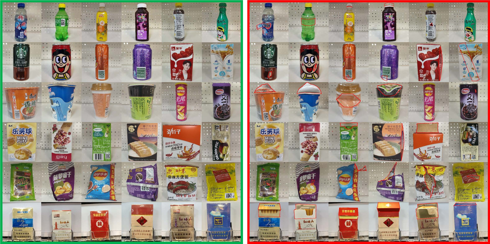

# GoodsAD
A Supermarket Goods Dataset for Unsupervised Anomaly Detection and Segmentation. 
Paper: [arXiv 2307.04956](https://arxiv.org/abs/2307.04956)

The GoodsAD dataset contains 6124 images with 6 categories of common supermarket goods.  Each category contains multiple goods. All images are acquired with 3000 × 3000 high-resolution. The object locations in the images are not aligned. Most objects are in the center of the images and one image only contains a single object. Most anomalies occupy only a small fraction of image pixels. Both image-level and pixel-level annotations are provided.

Each image is named with 6 digits, with the first three digits representing the category of the product and the last three representing the serial number. The dataset format is same as MVTec AD.

The dataset is created by Jian Zhang, Miaoju Ban (Open Lab on Human Robot Interaction, Peking University).

The figure shows the normal and anomalous images of six categories, and the table shows the details of the dataset.

|  Category   | Train (good) | Test (good) | Test (defective) | Sum |Anomaly type| Goods types |
|  ----  | ----  | ----  | ----  | ----  | ----  |----  |
| drink_bottle  | 733 | 356 | 425 | 1514 | 3|97|
| drink_can  | 234 | 147 | 147 | 528 | 3|59|
| food_bottle | 1014|243|361|1618|3|60|
|food_box|432|146|251|829|3|57|
|food_package|540|253|230|1023|2|95|
|cigarette_box|183|183|246|612|1|116|
|Sum|3136|1328|1660|6124|-|484|

## Download
The dataset are available at [OneDrive](https://mailhfuteducn-my.sharepoint.com/:f:/g/personal/2015216892_mail_hfut_edu_cn/Eu1ap3oe4OJCmQSpr8ouc4UBFbCT6SQt3d_yCz3R0CgLfQ?e=3svFSB) and [Baidu Disk](https://pan.baidu.com/s/1TJ-0NDUJPWFl8IN8K-p2mw?pwd=go8y).
<!-- 提取码：go8y -->

|Category|Size (GB)|Link1|Link2|
|  ----  | ----  |----  |----  |
|drink_bottle|2.9|[OneDrive](https://mailhfuteducn-my.sharepoint.com/:u:/g/personal/2015216892_mail_hfut_edu_cn/EeoscD4PU4VAoaiTeeGyrgEBRXoibgXiRHACWdRily-i-w?e=YENamB)|[Baidu Disk](https://pan.baidu.com/s/1mnL14Sd5jTWVH7ueA-zStg?pwd=d6mr)|
|drink_can|1.1|[OneDrive](https://mailhfuteducn-my.sharepoint.com/:u:/g/personal/2015216892_mail_hfut_edu_cn/Efs7rgdmVWJKu_eW2RxgswIBr15PdwwoDPnftnLbbjAyAw?e=iMR6Q6)|[Baidu Disk](https://pan.baidu.com/s/1XOsr5Fs0bQ0Ak4_Rhs_aaA?pwd=kg2z)|
|food_bottle|3.0|[OneDrive](https://mailhfuteducn-my.sharepoint.com/:u:/g/personal/2015216892_mail_hfut_edu_cn/ESib3l3xt4NLqEjVq76MykUBqgLsLbeDnSeCMb8YAOKbzg?e=fQDecg)|[Baidu Disk](https://pan.baidu.com/s/1SPuPz6ukOZcIfWIBMg9YhA?pwd=6qrb)|
|food_box|1.7|[OneDrive](https://mailhfuteducn-my.sharepoint.com/:u:/g/personal/2015216892_mail_hfut_edu_cn/EbZlumiFMxZGi2cjIrE-IGYBxiRFEjEBNNZCCI6frPEQVg?e=rMDeRj)|[Baidu Disk](https://pan.baidu.com/s/1zLTB9jIx-UxgDOqFOezS_Q?pwd=m6y8)|
|food_package|2.2|[OneDrive](https://mailhfuteducn-my.sharepoint.com/:u:/g/personal/2015216892_mail_hfut_edu_cn/ETInGCW7EOBKoFmh31-Y8PkB17MKP_iaVOhGLRuWyU1EQA?e=vQMcW4)|[Baidu Disk](https://pan.baidu.com/s/183pAoz7pTPwWkv4jE0aPuw?pwd=j9nc)|
|cigarette_box|1.4|[OneDrive](https://mailhfuteducn-my.sharepoint.com/:u:/g/personal/2015216892_mail_hfut_edu_cn/EU2Lgyz64k1En435HtDAtVMB1GlzidKCUA_tFLUIr5Wq-g?e=ZxabJ7)|[Baidu Disk](https://pan.baidu.com/s/177e2KPZrU5Z1C2rbei0rTg?pwd=nj7a)|

 we also conduct a thorough evaluation of current state-of-the-art unsupervised anomaly detection methods on the GoodsAD dataset. The pretained models are available at [OneDrive](https://mailhfuteducn-my.sharepoint.com/:f:/g/personal/2015216892_mail_hfut_edu_cn/EoITUN0LyvFMpEYG2dteBPEB6OX7PH0FPn0Ar2kSlg-QaA?e=HRyXlb) and [Baidu Disk](https://pan.baidu.com/s/1z-IU2DbEHVa9jTEquNuXtw?pwd=a11j).
<!-- 提取码：a11j -->
